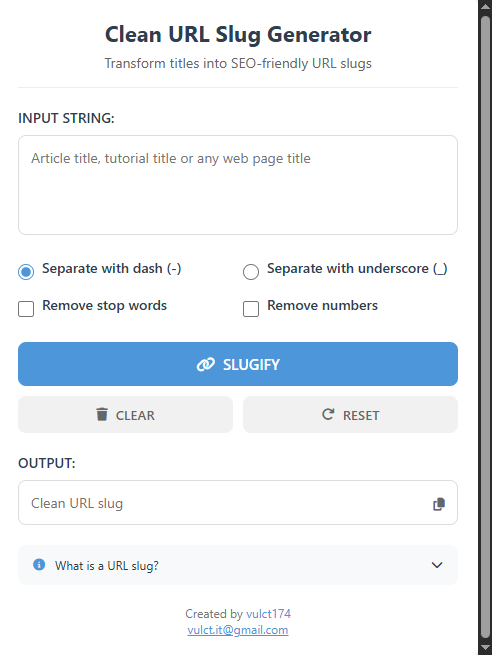

# Clean URL Slug Generator Chrome Extension

A professional Chrome extension that helps you generate clean, SEO-friendly URL slugs from any text input. Perfect for content creators, developers, and SEO professionals.


## 📸 Screenshot



## 🌟 Features

- **Smart Slug Generation**: Convert any text into URL-friendly slugs
- **Customizable Options**:
  - Choose between dash (-) or underscore (_) separators
  - Remove common stop words for cleaner slugs
  - Option to remove numbers
- **User-Friendly Interface**:
  - Real-time slug generation
  - One-click copy to clipboard
  - Clear and Reset functionality
  - Informative help section
- **Professional Design**:
  - Modern, clean interface
  - Responsive layout
  - Smooth animations
  - Intuitive controls

## 🚀 Installation

1. Clone or download this repository
2. Open Chrome and navigate to `chrome://extensions/`
3. Enable "Developer mode" in the top right corner
4. Click "Load unpacked" and select the extension directory

## 💡 Usage

1. Click the extension icon in your Chrome toolbar
2. Enter your text in the input field
3. Choose your preferred options:
   - Select separator type (dash or underscore)
   - Toggle stop words removal
   - Toggle number removal
4. The slug will be generated automatically as you type
5. Click the copy button to copy the slug to your clipboard

## 🛠️ Development

The extension is built with vanilla JavaScript and uses Chrome Extension Manifest V3.

### File Structure

```
clean-url-slug-generator/
├── manifest.json      # Extension configuration
├── popup.html        # Extension popup interface
├── popup.js          # Main functionality
├── styles.css        # Styling
├── assets/          # Images and media files
│   └── screenshot.png
├── icons/            # Extension icons
│   ├── icon16.png
│   ├── icon48.png
│   └── icon128.png
└── README.md         # Documentation
```

### Technologies Used

- HTML5
- CSS3
- Vanilla JavaScript
- Chrome Extension APIs
- Font Awesome Icons

## 📝 License

This project is licensed under the MIT License - see the [LICENSE](LICENSE) file for details.

## 👨‍💻 Author

**Vulct**
- GitHub: [@vulct174](https://github.com/vulct174)
- Email: [vulct.it@gmail.com](mailto:vulct.it@gmail.com)

## 🤝 Contributing

Contributions, issues, and feature requests are welcome! Feel free to check the [issues page](https://github.com/vulct174/clean-url-slug-generator/issues).

## 📞 Support

If you have any questions or need help, please:
1. Check the [issues page](https://github.com/vulct174/clean-url-slug-generator/issues)
2. Contact me via email: [vulct.it@gmail.com](mailto:vulct.it@gmail.com)

---

Made with ❤️ by [Vulct](https://github.com/vulct174)